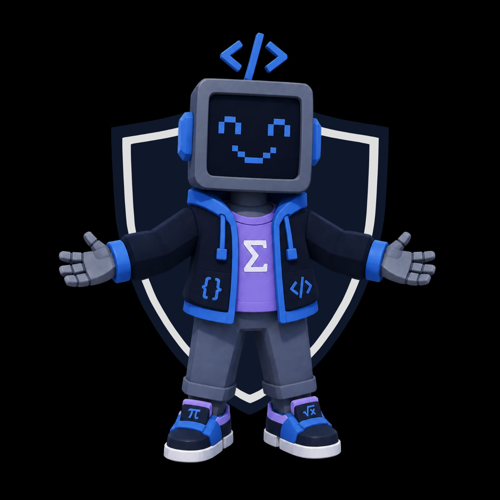

# CodeClash

## Description

CodeClash is a competitive mathematics and coding collaboration platform designed for students and developers to practice algorithm challenges, share solutions, and compete in timed coding and mathematic events. The project includes an interactive interface, and detailed documentation for each major feature.

## Table of Contents

- [Tech Stack](#tech-stack)
- [Demo Videos](#demo-videos)
- [Documentation](#documentation)
- [Project Board](#project-board)
- [GitHub Repo Structure](#github-repo-structure)
- [Team Profiles](#team-profiles)
- [Contact Us](#contact-us)

## Tech Stack

## Demo Videos

- Demo 1: Linked to Google Drive link

## Documentation

Demo 1

- [Software Requirements Specification](SRSdoc) Everything we need must be a singular SRS Document
- [API doc](docs/api-docs.html)

Demo 2

Coming soon!

Demo 3

Coming soon!

Demo 4

Coming soon!

## Project Board
We have the project board to keep track of the teams progress during the development process. It helps keep us on track and make the development progress efficient and transparent.

[GitHub Project Board](https://github.com/orgs/COS301-SE-2026/projects/33)

## GitHub Repo Structure
Our repo follows a monorepo structure

## Team Profiles

| Name | Role | Bio |
| --- | --- | --- |
|  **Nosandiso Mzoneli** | Team Lead, Backend Engineer  | I am a 3rd year Computer Science student at the University of Pretoria with a deep passion for gaming and problem-solving. My technical focus lies in backend development and systems integration, where I enjoy building the reliable, well-structured foundations that power great software. I naturally gravitate toward leadership, and currently serve as team lead, keeping the team aligned, communication clear, and delivery on track. When I'm not coding, you'll find me gaming...or modding that game. |
|  **Taskeen Abdoola** | UI/UX Engineer  | {Bio} |
|  **Morgan Calaca** | Frontend and Integration Engineer  | {Bio} |
|  **Swelihle Makhathini** | Full Stack Developer  | Computer Science student with experience in full-stack development, including API development and frameworks like Angular and React. I enjoy learning new technologies and adapting to different environments to tackle complex problems. Beyond the technical side, I bring strong communication skills and a collaborative mindset, shaped by group projects and an entrepreneurship module that taught me to think practically about problem-solving and iterative development. |
|  **Ntuthuko Mbatha** | {Insert Role}  | {Bio} |

## Contact Us

- Email:quantdevs@gmail.com
