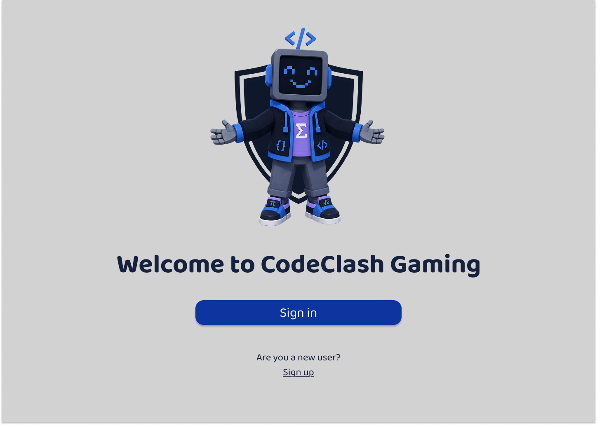
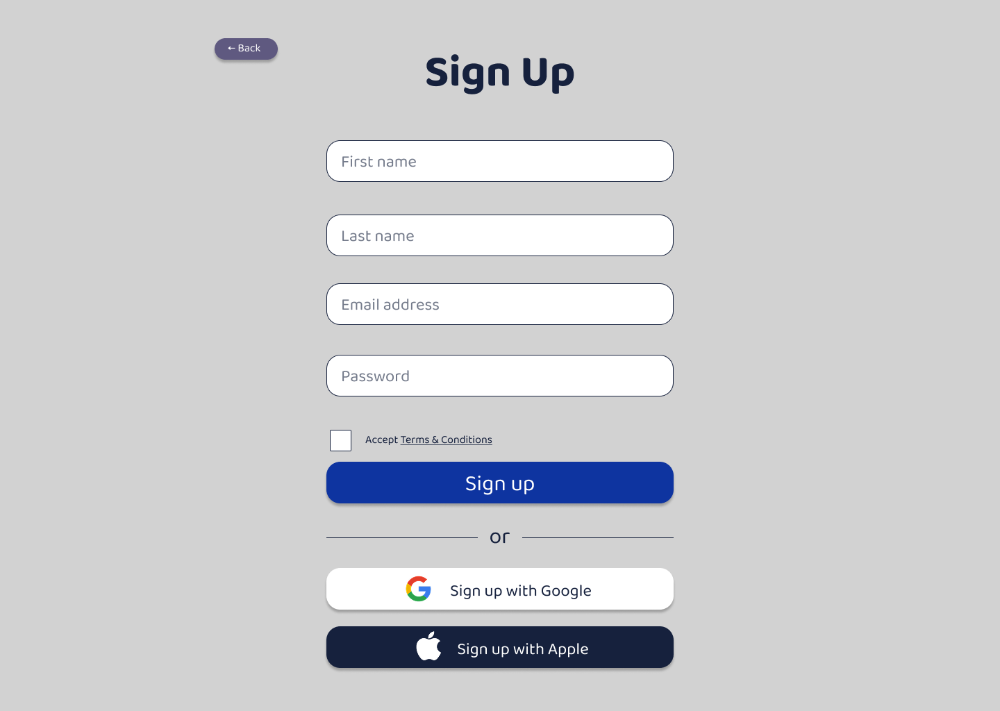
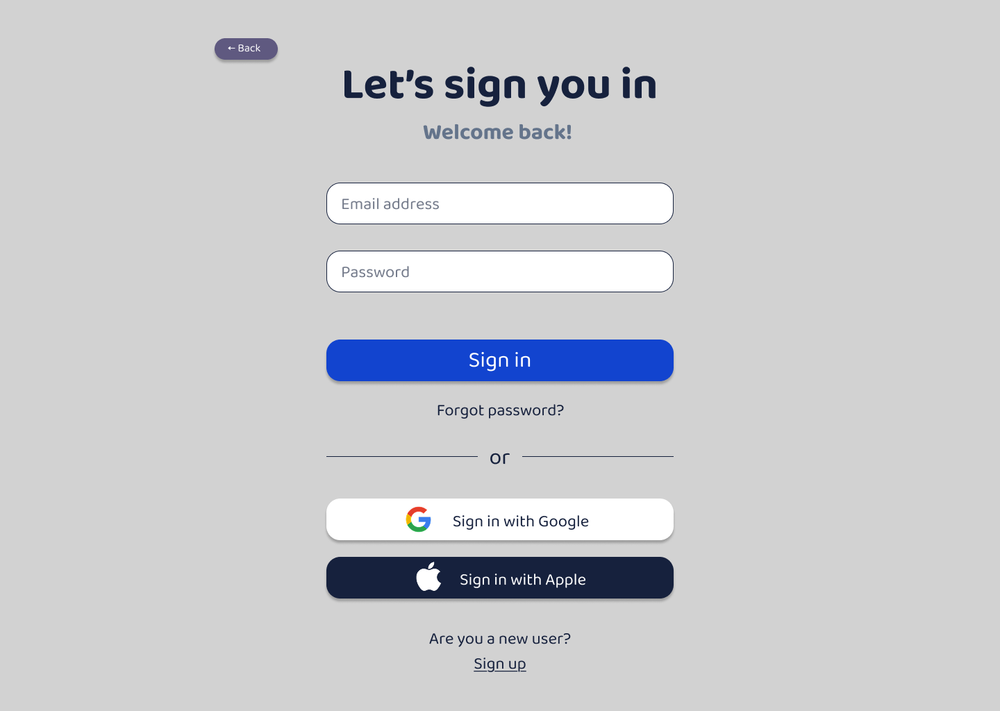
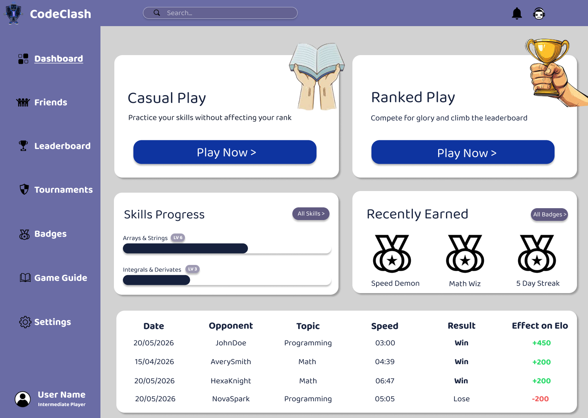
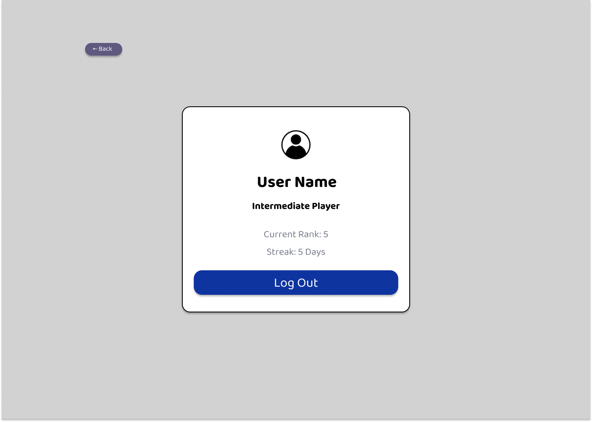
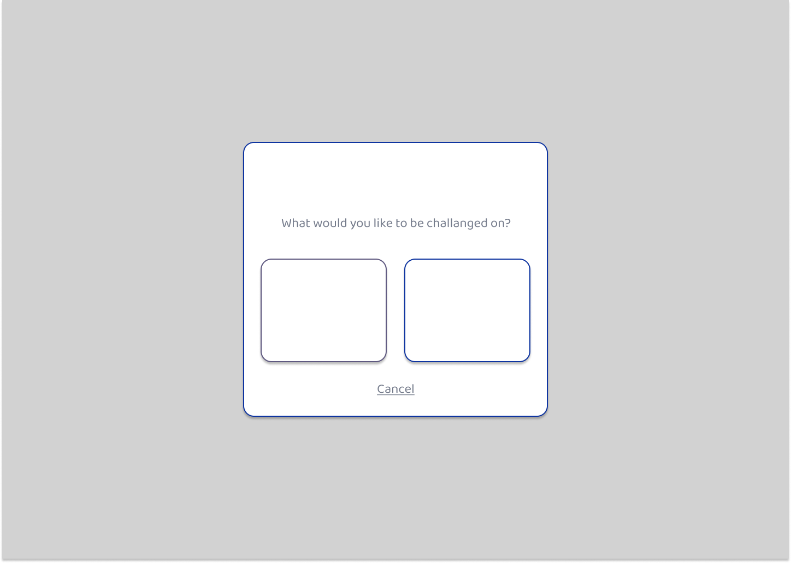
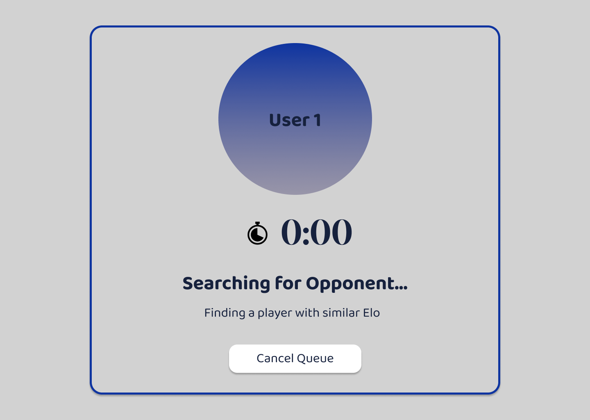
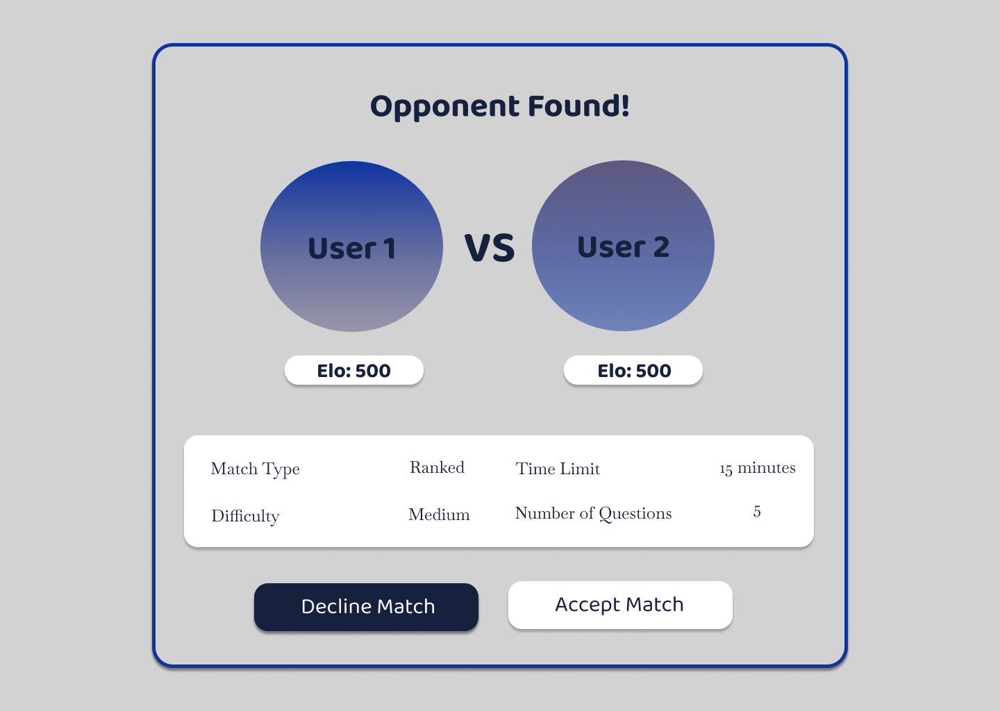
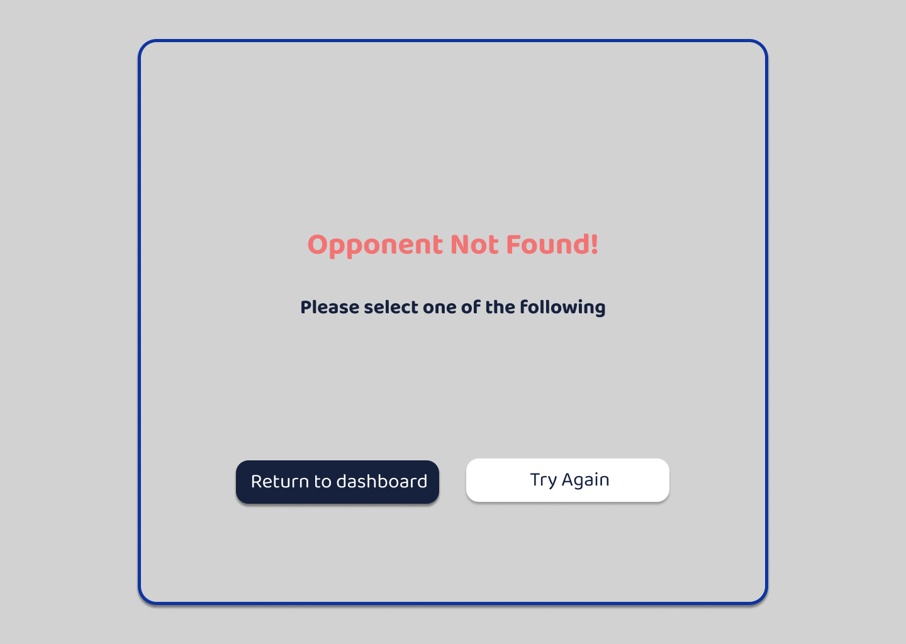
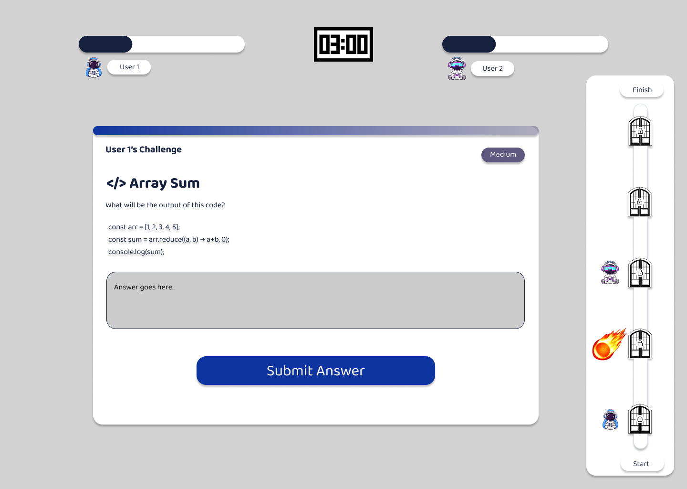

# CodeClash — Design Specifications

This section defines the visual, structural, and interaction design decisions that guide the development of the CodeClash Gaming platform. It serves as a blueprint to ensure consistency across components and teams, particularly in a modular development environment. The design specifications translate system requirements into concrete interface and user experience guidelines, reducing ambiguity during implementation.

## 1. Brand Style

The brand style defines the visual identity of CodeClash and ensures a consistent, professional appearance across all interfaces. 

### Colour Palette

The following colours form the primary palette. All colours were selected with WCAG AA contrast compliance in mind.

| Role                        | Hex       |
|-----------------------------|-----------|
| Primary text                | `#16213D` |
| Primary action (buttons)    | `#0E34A0` |
| Sidebar / header background | `#5F5980` |
| Page background             | `#D2D2D2` |
| Card background             | `#FFFFFF` |
| Win / positive ELO          | `#22C55E` |
| Lose / negative ELO         | `#EF4444` |

### Typography

| Typeface     | Role       | Weight          | Size Range |
|--------------|------------|-----------------|------------|
| Baloo Bhai 2 | Primary UI | 400 / 600 / 700 | 13–64 px   |

### Logo and Iconography

- The **CodeClash logo** is strategically displayed in main pages of the app such as:
    - Welcome
    - Sign Up
    - Sign In
    - Dashboard
- All icon and image imports reside in `src/assets/` and are referenced via static imports.

### Design Principles

- **Simplicity:** Pages present a single primary action per screen. Secondary actions are visually subordinate.
- **Hierarchy:** Bold weight and large size signal primary content; muted colours and smaller sizes indicate secondary information.
- **Responsiveness:** The design targets a **1440 × 1024 px** desktop viewport. 
- **Accessibility:** Colour contrast ratios meet WCAG AA. Interactive elements have visible focus states and descriptive ARIA labels.

### Accessibility

- **Colour contrast:** all body text on backgrounds meets WCAG AA (minimum 4.5:1).
- **Focus states:** all interactive elements receive a visible `drop-shadow` outline.
- **Semantic HTML:** headings use correct hierarchy (`h1 → h2 → h3`); buttons use `<button>`, not `
`.
- **ARIA labels:** icon-only buttons and decorative images carry `aria-hidden="true"` or descriptive `alt` text.
- **Form labels:** all inputs are associated with visible placeholder text and programmatic labels via `htmlFor`.

## 2. Wireframes

- The wireframes provide a representations of each key screen. They illustrate component placement, navigation flow, and interaction points. Annotations explain behaviour and design intent.
- **These wireframes can also be found as a figma file or pdf document in docs/wireframe.**

## Screen 1 — Welcome Page

The Welcome page is the first screen a user encounters upon launching the application. It serves as the entry point to the entire platform.

**Component Placement:**
- The codeclash mascot is centred horizontally, occupying the upper portion of the screen. It sits atop the shield icon.
- The heading "Welcome to CodeClash Gaming" is positioned centrally below the logo in Baloo Bhai 2 Bold, 64 px, `#16213D`.
- The "Sign in" button (500 × 60 px, fill `#0E34A0`) is centred below the heading, serving as the dominant call to action.
- The "Are you a new user?" prompt and "Sign up" link are stacked below the button, in smaller text (24 px), with "Sign up" underlined to indicate it is a navigable link.

**Navigation Flow:**
- "Sign in" → navigates to the Sign In screen.
- "Sign up" → navigates to the Sign Up screen.

**User Interaction Points:**
- Single primary action (Sign In) reduces cognitive load for returning users.
- New user path is present but visually subordinate to avoid overwhelming first-time visitors.

## Screen 2 — Sign Up Page

The Sign Up page collects the information needed to create a new account.

**Component Placement:**
- The "← Back" button (91 × 31 px, fill #5F5980) is anchored to the top-left at all times, providing a consistent escape route.
- The "Sign Up" heading (64 px, Baloo Bhai 2 Bold) is centred at the top of the form area.
- Four input fields (500 × 60 px each, white fill) are stacked vertically: First name, Last name, Email address, Password.
- The Terms & Conditions checkbox (31 × 31 px) and label sit below the password field, left-aligned to the form.
- The "Sign up" button (500 × 60 px, `#0E34A0`) is the primary action button.
- An "or" divider with two flanking lines (218 px each) separates the primary action from the social login options.
- "Sign up with Google" (`#FFFFFF`) and "Sign up with Apple" (`#16213D`) buttons (500 × 60 px each) are stacked below the divider, each carrying their respective provider icon at 28 × 28 px.

**Navigation Flow:**
- "← Back" → navigates to the Welcome screen.

**User Interaction Points:**
- All four fields must be completed and the Terms & Conditions checkbox must be ticked before the form can be submitted.
- Google and Apple sign-up buttons are OAuth entry points, reserved for a future backend integration. They are wired to placeholder callbacks (`onGoogleSignUp`, `onAppleSignUp`).

## Screen 3 — Sign In (Login) Page

The Sign In page allows existing users to authenticate and access their account.

**Component Placement:**
- "The "← Back" button (91 × 31 px, fill #5F5980) is anchored to the top-left at all times, providing a consistent escape route.
- The heading "Let's sign you in" (64 px, Baloo Bhai 2 Bold) is centred, with the sub-heading "Welcome back!" (32 px, Baloo Bhai 2 Bold, `#64748B`) directly beneath it.
- Two input fields (500 × 60 px): Email address and Password, stacked vertically.
- The "Sign in" button (500 × 60 px, `#0E34A0`, 2 px border) is the primary action.
- The "or" divider and social buttons follow the same layout as the Sign Up screen.
- "Are you a new user?" and "Sign up" link are positioned at the bottom of the form, offering a redirect for users who arrived at this screen by mistake.

**Navigation Flow:**
- "← Back" → navigates to the Welcome screen.
- "Sign up" link → navigates to the Sign Up screen.
- Successful sign-in → navigates to the Dashboard.

**User Interaction Points:**
- The "Welcome back!" sub-heading provides positive reinforcement for returning users.
- The "Are you a new user?" prompt at the bottom ensures users who reach this screen by mistake can self-correct without using the Back button.

## Screen 4 — Dashboard

The Dashboard is the main hub of the application, giving users an overview of their account, available game modes, skill progress, and recent achievements.

**Component Placement:**

*Sidebar:*
- The CodeClash logo occupies the top of the sidebar bar.
- The "CodeClash" wordmark (Baloo Bhai 2 Bold, 32 px) sits immediately to the right of the logo.
- 7 nav items with icons: 
    - Dashboard (active, underlined)
    - Friends
    - Leaderboard
    - Tournaments
    - Badges
    - Game Guide
    - Settings
- User profile, username, and player level label pinned to the bottom

*Header:*
- Search bar with icon, centred in the header
- Notification and future ai agent icons on the far right

*Play Cards:*
- Two equal white cards side by side
- Each has a title, description, decorative image overflowing the top-right edge, and a full-width "Play Now >" button at the bottom

*Mid Row:*
- Skills Progress card (left): title, "All Skills >" button, 2 skill rows each with a name, level badge, and progress bar
- Recently Earned card (right): title, "All Badges >" button, 3 badge icons with names below

*Bottom Row:*
- Full-width Match History card with a 6-column table: Date, Opponent, Topic, Speed, Result, Effect on Elo

**Navigation Flow:**
- "Play Now >" on Casual (future)
- "Play Now >" on Ranked → Topic Popup, then Queue
- "All Skills >" → Skills page (future)
- "All Badges >" → Badges page (future)
- Nav items → respective screens (future)
- User profile section → Profile page

**User Interaction Points:**
- Sidebar collapse toggle hides labels and user info, icons remain
- Active nav item highlighted with background and full white colour
- Ranked Play triggers a topic selection popup before entering queue
- Match History rows are read-only; Win is bold green, Lose is normal red, ELO change is colour-coded green/red
- Skill progress bars animate on load, filling to level / 10

## Screen 5 — Profile Page

The Profile page gives users a summary of their account information and statistics, and provides the logout action.

**Component Placement:**
- "The "← Back" button (91 × 31 px, fill #5F5980) is anchored to the top-left at all times, providing a consistent escape route.
- The page content is centred within a single white card that sits in the middle of the page.
- A circular icon is centred at the top of the card.
- The username is displayed directly below the icon.
- The user's email address sits below the username.
- The player level label ("Intermediate Player") is displayed below the email.
- A horizontal divider separates the identity block from the stats block.
- Two stat rows display Current Rank and Win Streak as label-value pairs.
- A second horizontal divider separates the stats from the logout action.
- The "Log Out" button (full card width × 60 px, `#0E34A0`) sits at the bottom of the card as the sole destructive action on the screen.

**Navigation Flow:**
- "← Back" → navigates to the Dashboard.
- "Log Out" → clears session state and navigates to the Welcome screen.

**User Interaction Points:**
- The profile circle on the Dashboard sidebar is the entry point to this screen; clicking it navigates here directly.
- The Log Out button uses the same visual weight as the primary Sign In / Sign Up buttons to signal it as the primary — and only — action on this page.
- Future iteration: the avatar circle will support a tap-to-upload interaction for custom profile photos.
- No form fields are present in this iteration; profile editing is reserved for a future settings screen.

## Screen 6 — Popup Page

The Popup page lets a user pick a topic before entering the ranked play queue.

**Component Placement:**
- Semi-transparent dark overlay behind the card
- Centred white card with "What would you like to be challenged on?" prompt
- Two equal selectable topic tiles side by side (Math, Programming)
- Cancel link centred below the tiles

**Navigation Flow:**
- Selecting a topic → Queue screen
- Cancel → dismisses popup, returns to Dashboard

**User Interaction Points:**
- Clicking a topic tile immediately proceeds to queue with that topic selected
- Cancel closes the popup without navigating away

## Screen 7 — Queue Page

The Queue page waits for a matched opponent.

**Component Placement:**
- Full-screen card with blue border
- Large circular avatar (User 1) centred in the upper half
- Stopwatch icon and live elapsed timer below the avatar
- "Searching for Opponent..." bold heading below the timer
- "Finding a player with similar Elo" sub-text beneath
- Cancel Queue button at the bottom

**Navigation Flow:**
- Opponent found → Opponent Found screen
- Timeout / no match → Opponent Not Found screen
- Cancel Queue → returns to Dashboard

**User Interaction Points:**
- Timer counts up in real time while searching
- Cancel Queue aborts matchmaking and navigates back

## Screen 8 — Found Page

The Found page displayes on successful searching and lets the players decline or accept the match.

**Component Placement:**
- Full-screen card with blue border
- "Opponent Found!" bold heading at the top
- Two avatar circles side by side with "VS" between them, each with an Elo badge below
- Match info panel below the avatars: Match Type, Difficulty, Time Limit, Number of Questions in a 2-column layout
- Decline Match and Accept Match buttons side by side at the bottom

**Navigation Flow:**
- Accept Match → Match Screen
- Decline Match → returns to Dashboard

**User Interaction Points:**
- Both players must accept for the match to start (future backend)
- Decline returns the user to the Dashboard without penalty

## Screen 9 — Not Found Page

The Not Found page displays on unsuccessful searching and promopts the user to either try again, or return.

**Component Placement:**
- Full-screen card with blue border
- "Opponent Not Found!" heading in red, centred
- "Please select one of the following" sub-heading below
- Two buttons side by side at the bottom: Return to Dashboard and Try Again.

**Navigation Flow:**
- Return to Dashboard → Dashboard
- Try Again → Queue screen

**User Interaction Points:**
- Try Again re-enters the queue with the same topic as before
- No penalty for either action

## Screen 10 — Match Screen Page

The Match Screen is the live game where players answer questions against each other.

**Component Placement:**
- Two player progress bars at the top, one left-aligned (User 1) and one right-aligned (User 2), each with an avatar and username
- Countdown timer centred between the two bars
- Main question card taking up the left portion: challenge title top-left, difficulty badge top-right, question heading, descriptive text, code snippet block, answer text area, and full-width Submit Answer button
- Progress tracker panel on the far right: vertical track from Start (bottom) to Finish (top) with question nodes, showing locked/unlocked state and player position indicators

**Navigation Flow:**
- Submitting the final answer → results / end screen (future)
- Timer reaching zero → auto-submit and end match (future)

**User Interaction Points:**
- Answer text area is the primary input; Submit Answer advances to the next question
- Progress tracker updates in real time as each player answers
- Player avatar icons appear on the tracker to show current position relative to opponent
- Difficulty badge on the question card indicates the challenge level for that question

## 3. Navigation Flow

