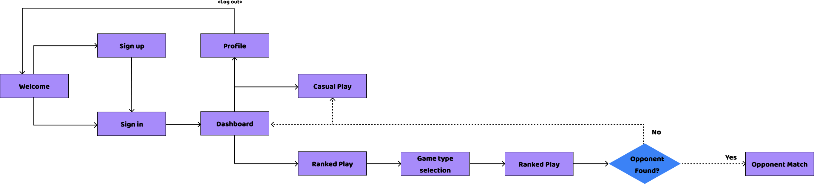

# CodeClash Frontend

We're using a React + TypeScript frontend built with vite.

## Tech Stack

| Tool             | Purpose                |
|------------------|------------------------|
| React            | UI framework           |
| TypeScript       | Type safety            |
| Vite             | Dev server and bundler |
| React Router DOM | Page routing           |

## Installation

- cd frontend
- For the pages: 
    - npm install
    - npm install react-router-dom
    - npm install -D tailwindcss postcss autoprefixer 
- For component testing:
    - npm install -D vitest @vitest/coverage-v8 @testing-library/react @testing-library/jest-dom @testing-library/user-event jsdom

## Running
- The App:
    - npm run dev
- The testing:
    - npm test (runs all tests once)
    - npm run test:watch (watch mode re-runs on file save)
    - npm run test:coverage (run with coverage report)
- Individual files for testing:
    - npx vitest run src/components/tests/FileName.test.tsx (FileName is the name of the file to test)

## Page URL's

The pages are currently using state-based routing, so they are live at the same URL. Navigation is done through the buttons via 'useState'.

## Navigation Flow

## Fonts

"Baloo Bhai 2" font is loaded via Google Fonts in each of the CSS files. This requires an internet connection when running.

## Notes

Google and Apple OAuth sign-ins are not implemented yet. The buttons are wired to prop callbacks (`onGoogleSignIn`, `onAppleSignIn`) and is ready for future integration.